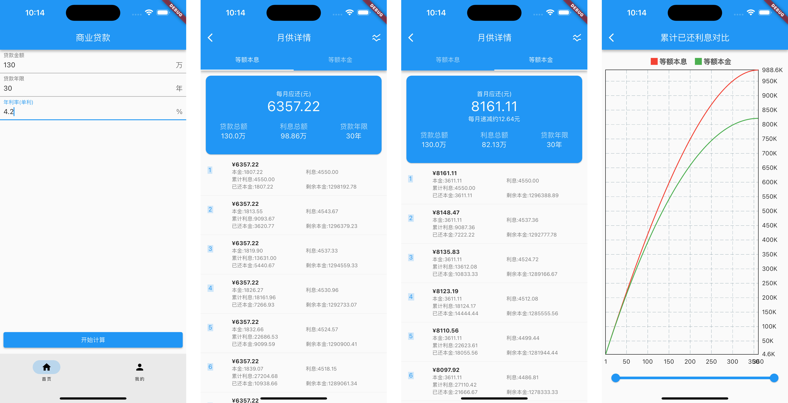

#  房贷计算器

[android apk下载地址 ](www.pgyer.com/fhlc)

# 1.项目背景

由于现在国家楼市的政策比较利好,应该还是会有一部分人考虑买房,所以做了这个工具.

以图表的方式来看5年或30年后累计利息对比等数据

# 2.屏幕截图

月供详情页参考贝壳App房贷计算工具

# 3.计划开发

目前图表只做了商业贷款的计算.

图表只做了等额本息和等额本金累计已还利息的对比

后续加入以下项.

* 月供总额对比
* 月供本金对比
* 月供利息对比
* 已还本金对比
* 剩余本金对比
* 组合贷+公积金贷款

# 4.感谢支持

如果这个工具能帮到您,非常荣幸!

如果您有更好的建议或需要定制开发的内容,可以随时联系我!

感谢您的支持,欢迎扫码请作者喝杯咖啡☕️.

